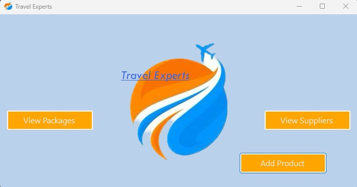
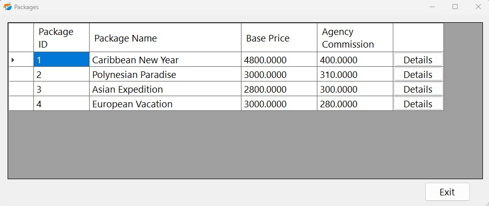
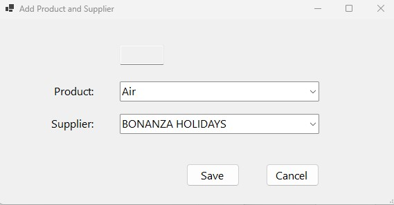
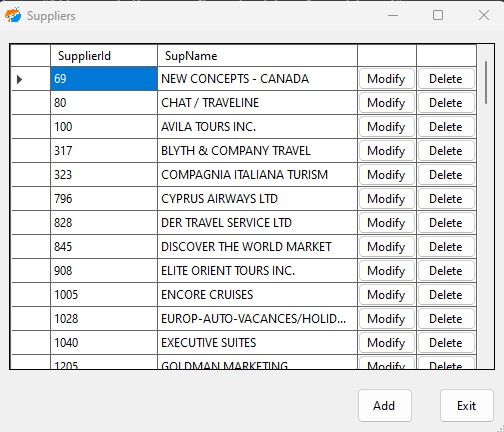
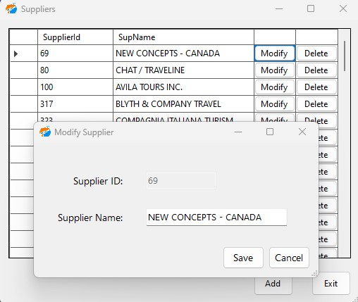
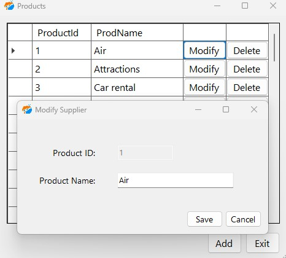

# Travel Experts App
> A windows forms app that features access to the data base enabling agents of the company the capability of adding or modify packages and adding/modifying their suppliers and products in order to update what the company offers.

## Table of Contents
* [General Info](#general-information)
* [Technologies Used](#technologies-used)
* [Screenshots](#screenshots)
* [Setup](#setup)

## General Information
- Travel app intented to allow users to add and modify packages or add and modify suppliers and their products (a user would be the agent)
- Intended to create a user experience to provide a platform that displays/modifies products
- Made as a final project for my class
<!-- You don't have to answer all the questions - just the ones relevant to your project. -->

## Technologies Used
- Bootstrap 5
- jQuery JS library 3.6
- Microsoft .NET
- C# 
- HTML5
- CSS

## Screenshots

Main Form

 

Packages Page

 

View Packages Form

 

View Details Form

 

Add Product & Supplier To Package
 

View Supplier Form

 

Modify Supplier Form

 

View Products Form

 

Modify Product Form

 

## Setup
after downloading all files in the repo (Visual Studio was used to build and run the Web App)
- then start TravelExpertsWorshop1.sln file
- set TravelExpertsData library as Startup project
- go to Project Manager Console and make sure the default project is set to TravelExpertsData
- cope and paste this scaffold in PM console Scaffold-DbContext -Connection "Data Source=localhost\sqlexpress;Initial Catalog=TravelExperts;Integrated Security=True;Encrypt=False" -Provider Microsoft.EntityFrameworkCore.SqlServer -Context TravelExpertsContext -OutputDir "look up where the TravelExpertsData folder is, right click and copy as path to paste here" -DataAnnotations
- now after it says complete make sure to set the TravelExperts project back as start up project
- Run the program and you should be able to navigate trough the page

## Thank you for reading
